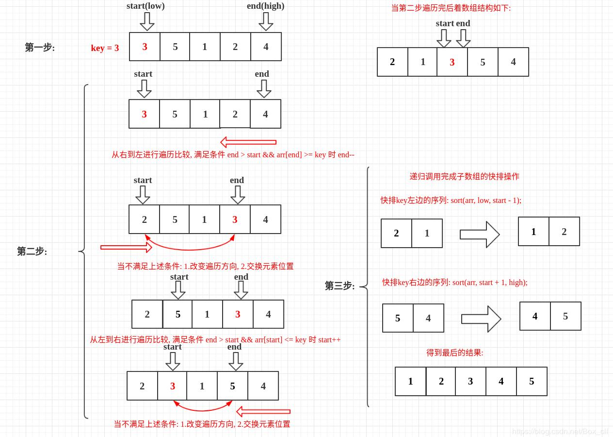

<!-- TOC -->

- [快速排序](#快速排序)
    - [基本介绍](#基本介绍)
        - [基本思想](#基本思想)
    - [快排图解](#快排图解)

<!-- /TOC -->

## 快速排序
### 基本介绍
- 快速排序(QuickSort)是对冒泡排序的一种改进

#### 基本思想  
- 通过一趟排序将要排序的数据分割成独立的两部分

- 其中一部分的所有数据都比另一部分的所有数据小

- 然后再按此方法对这两部分分别进行快速排序

- 整个排序过程可以递归进行, 最终将整个数据变成有序序列

****
### 快排图解

****
