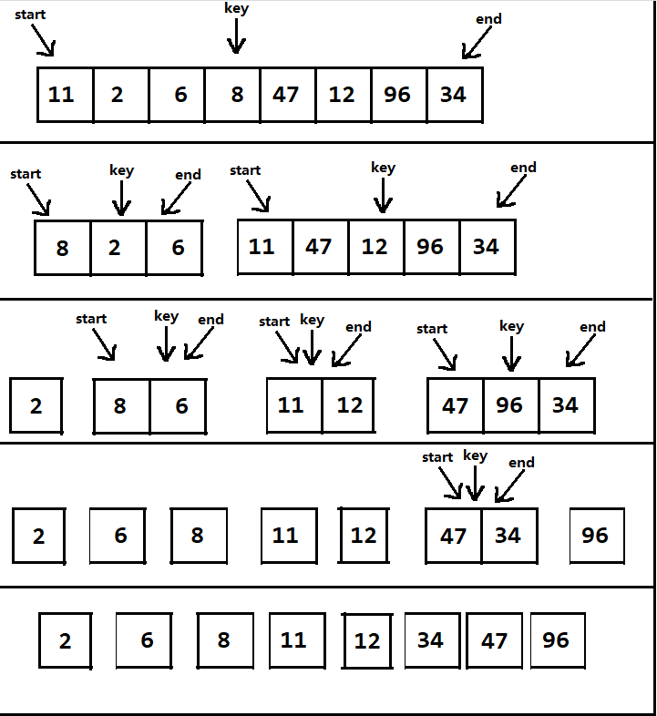

<!-- TOC -->

- [快速排序](#快速排序)
    - [基本介绍](#基本介绍)
        - [基本思想](#基本思想)
    - [快排图解](#快排图解)
        - [选数组首位作为 key 的情况](#选数组首位作为-key-的情况)
        - [选数组中轴作为 key 的情况](#选数组中轴作为-key-的情况)
    - [快排总结(选数组中轴作为 key 的情况)](#快排总结选数组中轴作为-key-的情况)

<!-- /TOC -->

## 快速排序
### 基本介绍
- 快速排序(QuickSort)是对冒泡排序的一种改进

#### 基本思想  
- 通过一趟排序将要排序的数据分割成独立的两部分

- 其中一部分的所有数据都比另一部分的所有数据小

- 然后再按此方法对这两部分分别进行快速排序

- 整个排序过程可以递归进行, 最终将整个数据变成有序序列

****
### 快排图解
#### 选数组首位作为 key 的情况

#### 选数组中轴作为 key 的情况
- 首先指定头尾指针 start 和 end, 第一次的头尾指针分别是数组的首末位
- 然后指定 key 值, 是头尾指针相加整除 即 (start+end)/2
- 头指针 start 向下移位遍历, 直到 arr[start] >= key 为止
- 尾指针 end 向上移位遍历, 直到 arr[end] <= key 为止
- 当 end > start 时, 两位互换, 然后 end-- 以及 start++
- 循环以上步骤 直到 end <= start 跳出循环
- 数组拆分, 然后再递归重复上述步骤

****
### 快排总结(选数组中轴作为 key 的情况)
- 快排的每一次递归调用其实是为了将选中的中轴元素排到数组中正确的位置
  - 指针移动最终都要定位到中轴身上, 因为中轴是正确位置, 下次递归的位置要根据中轴确立

- 每一轮当数组没有被分割到单元素时, 都会确立一个中轴元素的正确位置
  - 若已经被分割成单元素, 则单元素是顺序的

- 进入递归的前提是开始结束指针相等
  - 若没发生相等, 就依据条件进行元素位置互换, 然后继续循环检查, 直到指针相等
  - 当数组中轴前后元素都满足条件时, 指针挪动最终会让开始结束指针相等

- 直到数组被拆分成单个元素不能再拆分, 排序算法才会结束, 此时得到有序的数组