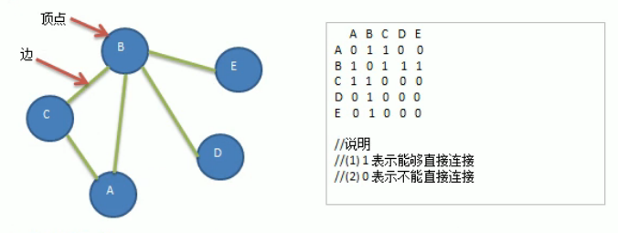

<!-- TOC -->

- [1. 图的深度优先(DFS)算法的原理](#1-图的深度优先dfs算法的原理)
  - [1.1. 图的遍历](#11-图的遍历)
  - [1.2. 深度优先遍历基本思想](#12-深度优先遍历基本思想)
  - [1.3. 深度优先遍历算法步骤](#13-深度优先遍历算法步骤)
  - [1.4. 深度优先遍历案例分析](#14-深度优先遍历案例分析)

<!-- /TOC -->

## 1. 图的深度优先(DFS)算法的原理

### 1.1. 图的遍历
- 所谓图的遍历, 就是对结点的访问.
- 遍历图的结点, 一般有两种访问策略:  
  - 深度优先遍历(Depth First Search)
  - 广度优先遍历

### 1.2. 深度优先遍历基本思想
- 深度优先遍历, 从初始访问结点出发, 初始访问结点可能有多个邻接结点,  
  深度优先遍历的策略就是首先访问第一个邻接结点,  
  然后再以这个被访问的邻接结点作为初始结点, 访问它的第一个邻接结点.  

- 可以这样理解: 每次都在访问完当前结点后首先访问当前结点的第一个邻接结点.

- 因此这种访问策略是优先往纵向挖掘深入,  
  而不是对一个结点的所有邻接结点进行横向访问.

- 显然, 深度优先搜索是一个递归的过程.

### 1.3. 深度优先遍历算法步骤
1) 访问初始结点 V, 并标记结点 V 为已访问.  

2) 查找结点 V 的第一个邻接结点 W.  

3) 若 W 存在, 则执行步骤 4;  
   若 W 不存在, 则返回步骤 1, 将从 V 的下一个结点继续.

4) 若 W 未被访问, 对 W 进行深度优先遍历递归.  
   即把 W 当做另一个 V, 然后执行步骤 1/2/3. 

5) 若 W 已经被访问, 则查找结点 W 的下一个邻接结点, 转到步骤 3.

### 1.4. 深度优先遍历案例分析 
  
**步骤:**  
- 首先设置初始结点是 A, 然后开始遍历, 输出结果为: A;

- A 的下一个邻接结点是 B, A 与 B 之间存在边, 输出结果为: A-B;

- B 结点变为新的初始结点, 对 B 进行深度优先遍历递归,  
  下一个邻接结点则为 C, B 与 C 之间存在边, 输出结果为: A-B-C;

- C 结点成为新的初始结点, 对 C 进行递归遍历,  
  下一个邻接结点为 D, 但不存在边, 因此返回上一步.

- B 结点的下一个结点为 D, B 与 D 之间存在边, 输出结果为: A-B-C-D;

- D 结点成为新的初始结点, 对 D 进行递归遍历,  
  下一个邻接结点为 E, D 与 E 之间存在边, 输出结果为 A-B-C-D-E;  
  
- 至此, 全部结点输出完毕, 遍历结束.