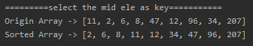
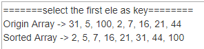

<!-- TOC -->

- [快速排序(选择中轴元素作为 key 的情况)](#快速排序选择中轴元素作为-key-的情况)
- [快速排序(选择数组首位作为 key 的情况)](#快速排序选择数组首位作为-key-的情况)
- [测试结果](#测试结果)
    - [选中间值作为 key](#选中间值作为-key)
    - [选首位值作为 key](#选首位值作为-key)

<!-- /TOC -->

### 快速排序(选择中轴元素作为 key 的情况)
- 实现细节看代码注释
```java
package com.leo9.dc15.quick_sort;

import java.util.Arrays;

public class QuickSort {
    public static void main(String[] args) {
        int[] arr = {11, 2, 6, 8, 47, 12, 96, 34, 207};
        System.out.println("Origin Array -> " + Arrays.toString(arr));
        sortArray(arr, 0, arr.length - 1);
        System.out.println("Sorted Array -> " + Arrays.toString(arr));
    }

    public static void sortArray(int[] arr, int low, int high){
        //指定开始结束指针
        int start = low;
        int end = high;
        //指定key值
        int key = arr[(low + high)/2];
        //指定临时变量, 用于交换的时候用
        int temp;

        //开始循环, 当开始指针在结束指针后面时执行
        while(end > start){
            //开始指针向下移动
            while(arr[start] < key){
                start ++;
            }
            //结束指针向上移动
            while(arr[end] > key){
                end --;
            }
            //当开始结束指针相等的时候跳出循环
            if(end == start){
                break;
            }
            //若开始结束指针没有相等, 就将开始结束指针指向的元素位置互换
            else {
                temp = arr[start];
                arr[start] = arr[end];
                arr[end] = temp;
            }
        }

        //当结束指针还没指到数组首位时就继续进行分割数组递归排序
        //开始指针要下移一位, 结束指针则要上移一位, 然后判断是否越界, 再进行递归
        if(end > low){
            sortArray(arr, low, end-1);
        }
        //当开始指针还没指到数组末位时就继续进行分割数组递归排序
        if(start < high){
            sortArray(arr, start+1, high);
        }
    }
}

```

****
### 快速排序(选择数组首位作为 key 的情况)

```java
/**
 * 快速排序:
 * 选择一个关键值作为基准值。比基准值小的都在左边序列(一般是无序的),
 * 比基准值大的都在右边(一般是无序的)。一般选择序列的第一个元素。
 */
public class QuickSort {
    public static void main(String[] args) {
        int arr[] = new int[]{3, 5, 1, 2, 4};
        sort(arr, 0, a.length - 1);
        printArr(a);
    }
 
    public static void sort(int arr[], int low, int high){
        int start = low;//指定开始的索引
        int end = high;//指定结束的索引
        int key = arr[low];//设置比较值为
        while (end > start){
            //从后往前比较
            while (end > start && arr[end] >= key){
                //如果没有比关键值小的,比较下一个,直到有比关键值小的交换位置,然后又从前往后比较
                end--;
            }
            //将 arr[end] 和 arr[start] 进行交换
            if(arr[end]<=key){
                int temp = arr[end];
                arr[end] = arr[start];
                arr[start] = temp;
            }
            //从前往后比较
            while(end > start && arr[start] <= key){
                //如果没有比关键值大的,比较下一个,直到有比关键值大的交换位置
                start++;
            }
            //将 arr[end] 和 arr[start] 进行交换
            if(arr[start]>=key){
                int temp = arr[start];
                arr[start] = arr[end];
                arr[end] = temp;
            }
        }
        //递归进行左侧快排
        if(start > low){
            sort(arr, low, start - 1);//左边序列。第一个索引位置到关键值索引-1
        }
        //递归进行右侧快排
        if(end < high){
            sort(arr, end + 1, high);//右边序列。从关键值索引+1 到最后一个
        }
    }
 
    public static void printArr(int arr[]){
        for (int i = 0; i < arr.length; i++) {
            if (i == arr.length - 1){
                System.out.print(arr[i]);
            }else {
                System.out.print(arr[i] + ", ");
            }
        }
    }
}
```

****
### 测试结果
#### 选中间值作为 key


#### 选首位值作为 key
