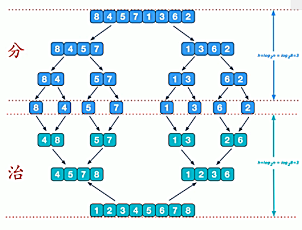
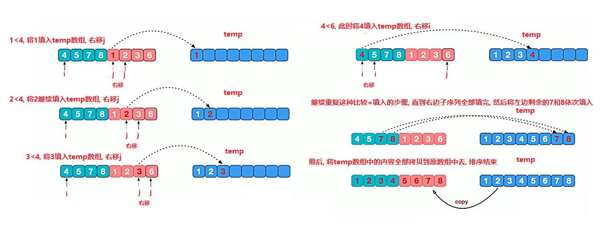

<!-- TOC -->

- [归并排序](#归并排序)
    - [基本介绍](#基本介绍)
    - [算法图解](#算法图解)
        - [流程概述](#流程概述)
        - [合并图示](#合并图示)

<!-- /TOC -->

## 归并排序
### 基本介绍
- 归并排序(merge sort)是利用归并的思想实现的排序方法

- 算法采用经典的分治(divide&conquer)策略

- 分治法将问题分成一些小的问题然后递归求解,   
  最后将各个分解出来的问题的答案进行合并.

****
### 算法图解
#### 流程概述
- 可以看到这种结构很像一颗完全二叉树
- 归并排序可以用递归去实现, 也可以用迭代去实现
- 分治算法的核心在于合并, 拆分过程仅仅只是拆分数组而已

****
#### 合并图示
用最后一趟合并来示例算法的合并阶段的流程
- 在最后一趟排序中是要将 2 个分出来排好序的不同部分合并

- 首先定义指针 i 和 j 分别指向每个部分的首位元素

- 将 i 和 j 所指向的元素进行比较, 将小的那一位移入 temp 数组,  
  然后将指针向后移动, 循环元素比较的过程, 直到一边的指针移出边界外为止

- 当有一方的指针已经超出边界, 另一方则把剩下的元素以当前指针指向为起点,  
  顺序将剩余元素都移入 temp 数组中

- 当两边的指针都超出边界时, 说明数组排序完毕,  
  然后将 temp 数组拷贝给原数组, 完成排序

****