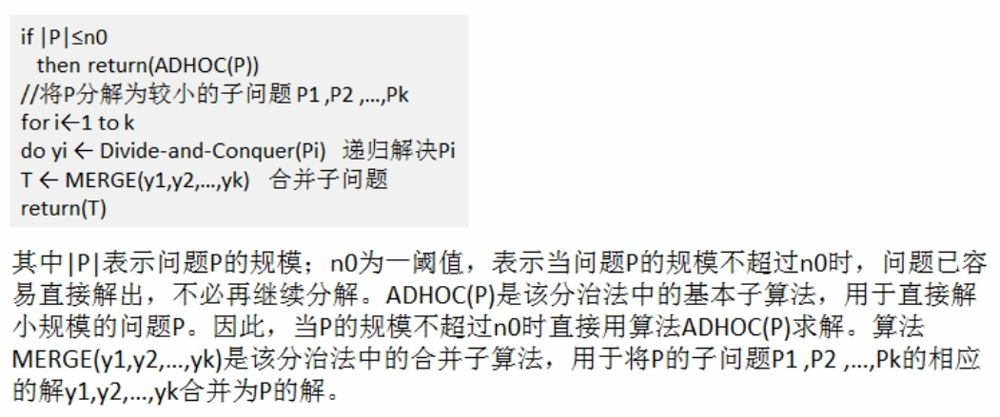

<!-- TOC -->

- [1. 分治算法的设计模式](#1-分治算法的设计模式)
  - [1.1. 分治算法的基本介绍](#11-分治算法的基本介绍)
  - [1.2. 分治算法的基本步骤](#12-分治算法的基本步骤)
    - [1.2.1. 分治算法设计过程](#121-分治算法设计过程)
- [2. 分治算法解决汉诺塔问题](#2-分治算法解决汉诺塔问题)
  - [2.1. 问题介绍](#21-问题介绍)
  - [2.2. 思路分析](#22-思路分析)

<!-- /TOC -->

## 1. 分治算法的设计模式

### 1.1. 分治算法的基本介绍
- 分治算法是一种很重要的算法
- 字面上的解释是分而治之,  
  就是把一个复杂的问题分成两个或更多的相同或相似的子问题,  
  再把子问题分解成更小的子问题, 直到最后子问题可以简单的求解,  
  原问题的解即子问题的解的合并.

- 这个技巧是很多高效算法的基础, 如排序算法(快排, 归并),  
  傅里叶变换(快速傅立叶变换)...

- 分治算法可以解决一些经典问题
  - 二分搜索
  - 大整数乘法
  - 棋盘覆盖
  - 归并排序
  - 快速排序
  - 线性时间选择
  - 最接近点对问题
  - 循环赛日程表
  - 汉诺塔问题

### 1.2. 分治算法的基本步骤
分治算法在每一层递归上都有三个步骤:
1) 分解: 将原问题分解为若干个规模很小, 相互独立, 与原问题形式相同的子问题
2) 解决: 若子问题规模较小而容易被解决则直接解决, 否则递归地解各个子问题
3) 合并: 将各个子问题的解合并为原问题的解

#### 1.2.1. 分治算法设计过程

## 2. 分治算法解决汉诺塔问题

### 2.1. 问题介绍
汉诺塔（又称河内塔）问题是源于印度一个古老传说的益智玩具. 
大梵天创造世界的时候做了三根金刚石柱子, 在一根柱子上从下往上按照大小顺序摞着64片黄金圆盘.  
大梵天命令婆罗门把圆盘从下面开始按大小顺序重新摆放在另一根柱子上.  
并且规定, 在小圆盘上不能放大圆盘, 在三根柱子之间一次只能移动一个圆盘.  
假如每秒钟一次, 需要移动 18446744073709551615 次, 移完这些金片需要 5845.42 亿年以上.

### 2.2. 思路分析