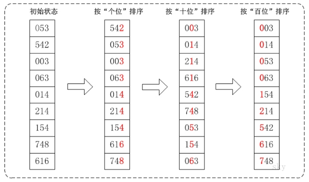

<!-- TOC -->

- [基数排序](#基数排序)
  - [基本介绍](#基本介绍)
  - [基本思想](#基本思想)
  - [图文说明](#图文说明)
  - [注意事项](#注意事项)

<!-- /TOC -->

## 基数排序

### 基本介绍
基数排序(radix sort)属于 "分配式排序"(distribution sort), 又称 "桶子法"(bucket sort),  
顾名思义, 它是通过键值的各个位的值, 将要排序的元素分配至某些桶中, 达到排序的作用.

基数排序法是稳定的排序, 而且是效率高的稳定排序法.

基数排序是桶排序的扩展, 是赫尔曼何乐礼在 1887 年发明的.

它通过将整数按位数切割成不同的数字, 然后按每个位数分别比较.

****
### 基本思想
- 将所有待比较数值统一为同样的数位长度, 数位较短的数前面补零.

- 然后从最低位开始, 依次进行一次排序, 直到最高位排序完成.

- 最后到最高位排序完成后, 数列就变成有序序列.

****
### 图文说明
对数组 `{53, 3, 542, 748, 14, 214, 154, 63, 616}` 进行基数排序,   
它的示意图如下:  

在上图中, 首先将所有待比较树脂统一为统一位数长度, 接着从最低位开始, 依次进行排序.
1. 按照个位数进行排序.
2. 按照十位数进行排序.
3. 按照百位数进行排序.
排序后, 数列就变成了一个有序序列.

****
### 注意事项
1. 基数排序是经典的空间换时间的方式, 占用内存很大,  
   对海量数据进行排序时容易出现 OutOfMemoryError 内存不足

2. 基数排序是稳定的排序算法.
   
3. 算法稳定的定义:  
     - 若在待排序数据中, 存在多个具有相同的关键字的记录,  
       经过排序后这些记录的相对次序保持不变, 算法就是稳定的.
        
     - 即在原序列中 r[i]=r[j], 且 r[i] 在 r[j] 之前,  
       在排序过后, r[i] 仍在 r[j] 之前, 则算法稳定,  
       否则算法就是不稳定的.

4. 有负数的数组, 不用基数排序进行排序,  
   如果需要支持负数, 需要进行修改调整.