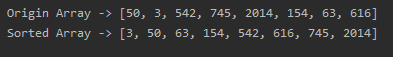
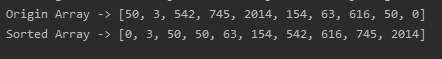

<!-- TOC -->

- [代码实现](#代码实现)
- [测试结果](#测试结果)
  - [数组1](#数组1)
  - [数组2](#数组2)

<!-- /TOC -->

### 代码实现
- 注意: 这个算法目前不支持负数, 只支持正整数
  
```java
package com.leo9.dc17.bucket_sort;

import java.util.Arrays;

public class BucketSort {
    public static void main(String[] args){
        int[] arr = {50, 3, 542, 745, 2014, 154, 63, 616};
        System.out.println("Origin Array -> " + Arrays.toString(arr));
        radixSort(arr);
        System.out.println("Sorted Array -> " + Arrays.toString(arr));
    }

    //基数排序方法
    public static void radixSort(int[] arr){
        //获取最大值, 遍历数组
        int maxNum = arr[0];
        for (int i = 1; i < arr.length; i++) {
            if(arr[i] > maxNum)
                maxNum = arr[i];
        }

        //建立水桶数组, 二维数组, 每个子数组长度为 arr.length + 1
        //子数组的第0位用来记录该数组存在的元素个数
        int[][] bucketArr = new int[10][arr.length + 1];

        //取出不同位上的数字, 由 i 决定取什么位, 从 10^0 位开始
        for (int i = 1; maxNum / i > 0 ; i *= 10) {
            //开始遍历目标数组的每一位将其当前要求的指数位数值取出并判断, 将其放入所对应的桶中
            for (int j = 0; j < arr.length; j++) {
                //记录这个桶中数的数量, 每个水桶第0位都是计数位
                bucketArr[arr[j] / i % 10][0]++;
                //在这个桶中的第 bucketArr[arr[j] / i % 10][0] 位, 放入目标数组的当前元素
                bucketArr[arr[j] / i % 10][bucketArr[arr[j] / i % 10][0]] = arr[j];
            }

            //进行当前指数位的排序, 初始化指向指针.
            //实际上只是按顺序从小到大输出水桶数组到原数组从而完成排序
            int point = 0;
            for (int j = 0; j < 10; j++) {
                //当前指数位数值是j所对应的桶内有多少个元素, 从0开始
                int temp = bucketArr[j][0];
                for (int k = 0; k < temp; k++) {
                    arr[point] = bucketArr[j][k+1];
                    point++;
                }
                //还原水桶计数位
                bucketArr[j][0] = 0;
            }
        }
    }
}

```

### 测试结果

#### 数组1


#### 数组2
