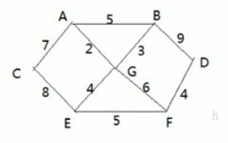
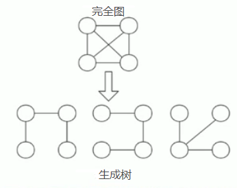
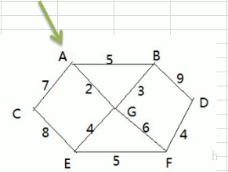
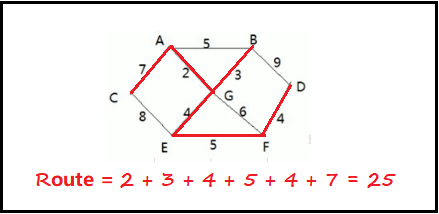

<!-- TOC -->

- [1. 普里姆算法的原理](#1-普里姆算法的原理)
  - [1.1. 应用场景-修路问题](#11-应用场景-修路问题)
  - [1.2. 修路问题的思路分析](#12-修路问题的思路分析)
  - [1.3. 修路问题的本质分析](#13-修路问题的本质分析)
    - [1.3.1. 最小生成树基本介绍](#131-最小生成树基本介绍)
  - [1.4. 普里姆算法的基本介绍](#14-普里姆算法的基本介绍)
  - [1.5. 普里姆算法的步骤详解](#15-普里姆算法的步骤详解)
  - [1.6. 普里姆算法的步骤图解](#16-普里姆算法的步骤图解)

<!-- /TOC -->

## 1. 普里姆算法的原理

### 1.1. 应用场景-修路问题
- 如下图所示的场景以及下面列出的问题  
  

1) 某地有 7 个村庄 `[A, B, C, D, E, F, G]`, 现需要修路将 7 个村庄连通.

2) 个个村庄的距离用边表示(权), 如 `A-B` 距离 5 公里.  

3) 如何修路保证各个村庄都能连通, 并且总的修建公路总里程最短?  

### 1.2. 修路问题的思路分析
- 如果直接将 10 条边都连接起来, 虽然能保证村庄连通,  
  但得到的总里程数并不是最小的, 因此这种方式不可行.

- 正确的思路应该是尽可能少地选择路线, 并且每条路线的长度最小,  
  在保证连通的前提下, 让每条路线的长度加起来的总里程数最小.

### 1.3. 修路问题的本质分析
修路问题实际是最小生成树问题, 最小生成树(Minimum Cost Spanning Tree), 简称 MST.  

#### 1.3.1. 最小生成树基本介绍

- 给定一个带权的无向连通图, 通过选取一棵生成树,  
  使树上所有边的权值总和最小, 这就是最小生成树.

- MST 如果有 N 个顶点, 那么一定会有 N-1 条边.

- MST 包含了完全图的全部顶点, N-1 条边都可在完全图中找到.

- 获取最小生成树的算法主要是普里姆算法和克鲁斯卡尔算法.

### 1.4. 普里姆算法的基本介绍
普里姆(Prim)算法求最小生成树, 也就是在包含 n 个顶点的连通图中,  
找出只有 n-1 条边包含所有 n 个顶点的连通子图, 也就是极小连通子图.

### 1.5. 普里姆算法的步骤详解
1) 设 `G={V, E}` 是连通网, `T={U, D}` 是最小生成树,  
   其中 V 和 U 是顶点集合, 而 E 和 D 是边的集合.

2) 若从顶点 `u[i]` 开始构造最小生成树,  
   则从集合 V 中取出顶点 `u[i]` 放入集合 U 中,  
   标记顶点 v 的 `visited[u[i]]=1`.

3) 若集合 U 中顶点 `u[i]` 与集合 V-U 中的顶点 `v[j]` 之间存在边,  
   则寻找这些边中权值最小的边, 但不能构成回路(即起点终点都是同一点),  
   将顶点 `v[j]` 放入集合 U 中, 将边 `(u[i], v[j])` 加入集合 D 中,  
   标记 `visited[v[j]]=1`.

4) 重复步骤 2, 直到 U 和 V 相等, 即所有顶点都标记为已访问,  
   此时 D 集合中存在着 `n-1` 条边.

### 1.6. 普里姆算法的步骤图解
  
- 假设从点 A 开始构造 MST:    
  - 将 A 先放入集合 U 中, 此时集合 `U = {A}`;  
  - 能跟 A 直接连通的顶点如下: `A-C[7], A-G[2], A-B[5]`;  
  - 其中 `A-G[2]` 的权值最小, 将 G 放入集合 U 中, `U = {A, G}`.

- 以 `U = {A, G}` 为子图继续构造:  
  - 将 A 和 G 顶点和它们相邻还没进行访问的顶点进行处理;
  - A 顶点未访问的顶点为 `A-C[7], A-B[5]`;
  - G 顶点未访问的顶点为 `G-B[3], G-E[4], G-F[6]`;
  - 其中 `G-B[3]` 权值最小, 将 B 放入 U 中, `U = {A, G, B}`.

- 以 `U = {A, G, B}` 为子图继续构造:  
  - 将 A 和 G, B 顶点和它们相邻还没进行访问的顶点进行处理;
  - A 顶点未访问的顶点为 `A-C[7]`;
  - G 顶点未访问的顶点为 `G-E[4], G-F[6]`;
  - B 顶点未访问的顶点为 `B-D[9]`;  
  - 其中 `G-E[4]` 权值最小, 将 E 放入 U 中, `U = {A, G, B, E}`.

- 以 `U = {A, G, B, E}` 为子图继续构造:  
  - 将 A 和 G, B, E 顶点和它们相邻还没进行访问的顶点进行处理;
  - A 顶点未访问的顶点为 `A-C[7]`;
  - G 顶点未访问的顶点为 `G-F[6]`;
  - B 顶点未访问的顶点为 `B-D[9]`;  
  - E 顶点未访问的顶点为 `E-C[8], E-F[5]`; 
  - 其中 `E-F[5]` 权值最小, 将 F 放入 U 中, `U = {A, G, B, E, F}`.  

- 以 `U = {A, G, B, E, F}` 为子图继续构造:  
  - 将 A 和 G, B, E 顶点和它们相邻还没进行访问的顶点进行处理;
  - A 顶点未访问的顶点为 `A-C[7]`;
  - G 顶点未访问的顶点为 `null`;
  - B 顶点未访问的顶点为 `B-D[9]`;  
  - E 顶点未访问的顶点为 `E-C[8]`;  
  - F 顶点未访问的顶点为 `F-D[4]`;
  - 其中 `F-D[4]` 权值最小, 将 D 放入 U 中, `U = {A, G, B, E, F, D}`.

- 以 `U = {A, G, B, E, F, D}` 为子图继续构造:  
  - 将 A 和 G, B, E 顶点和它们相邻还没进行访问的顶点进行处理;
  - A 顶点未访问的顶点为 `A-C[7]`;
  - G 顶点未访问的顶点为 `null`;
  - B 顶点未访问的顶点为 `null`;  
  - E 顶点未访问的顶点为 `E-C[8]`;  
  - F 顶点未访问的顶点为 `null`;  
  - D 顶点未访问的顶点为 `null`;  
  - 其中 `A-C[7]` 权值最小, 将 C 放入 U 中, `U = {A, G, B, E, F, D, C}`.

- 至此 `U {A, G, B, E, F, D, C} = V {A, B, C, D, E, F, G}`,  
  结束构造过程, 算法结束.  

- 最终得出的结果如下图所示, 红线为选择的通路, 总路程为 25.  
    