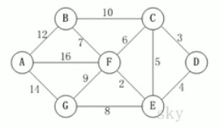
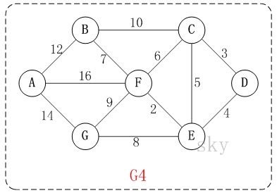
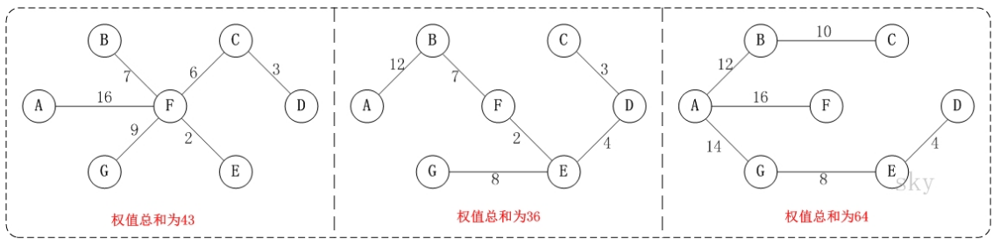
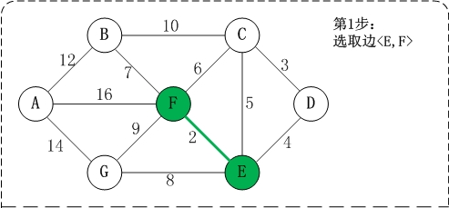
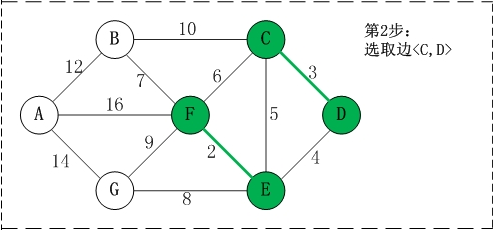
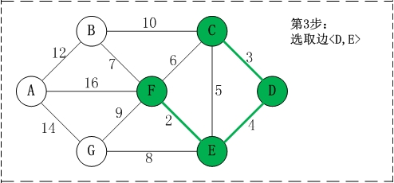
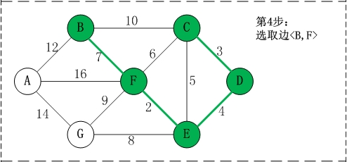
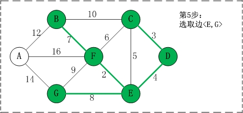
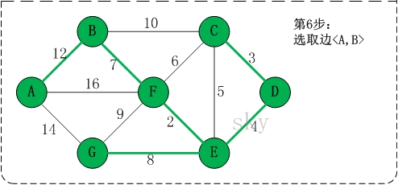
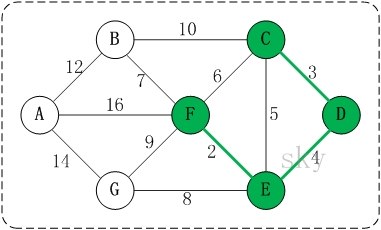

<!-- TOC -->

- [1. 克鲁斯卡尔(Kruskal)算法的原理](#1-克鲁斯卡尔kruskal算法的原理)
  - [1.1. 算法应用场景-公交站问题](#11-算法应用场景-公交站问题)
  - [1.2. 算法基本介绍](#12-算法基本介绍)
  - [1.3. 算法图解说明](#13-算法图解说明)
    - [1.3.1. 最小连通子图的概念说明](#131-最小连通子图的概念说明)
    - [1.3.2. 构建最小连通子图的步骤](#132-构建最小连通子图的步骤)
    - [1.3.3. 算法的关键步骤分析](#133-算法的关键步骤分析)
    - [1.3.4. 对回路的概念和判断的说明](#134-对回路的概念和判断的说明)

<!-- /TOC -->

## 1. 克鲁斯卡尔(Kruskal)算法的原理

### 1.1. 算法应用场景-公交站问题
  
- 某市新增 7 个站点 `{'A','B','C','D','E','F','G'}`, 现要把 7 个站点连通.
- 各个站点的距离用边线表示(权), 比如 `A-B` 距离 12 公里.  
- 如何修路保证各个站点都能连通, 并且修建的公路总里程最短?
- 本质上依旧是最小生成树问题.

### 1.2. 算法基本介绍
- 克鲁斯卡尔算法, 是用来求加权连通图的最小生成树的算法.

- 基本思想:  
  按照权值从小到大的顺序选择 n-1 条边, 并保证这些边不构成回路.

- 具体做法:  
  首先构造一个只含 n 个顶点的森林,  
  根据权值从小到大从连通网中选择边加入到森林中,  
  并使森灵中不产生回路, 直至森林变成一棵树为止.

### 1.3. 算法图解说明

#### 1.3.1. 最小连通子图的概念说明
  
- 在含有 n 个顶点的连通图中选择 `n-1` 条边, 构成极小连通子图,  
  并使该连通子图中 `n-1` 条边上的权值之和最小, 称为最小生成树.
  
  
- 如上图所示的连通网可以有多棵权值总和不相同的生成树.

#### 1.3.2. 构建最小连通子图的步骤
- 以上图为例, 来对克鲁斯卡尔进行演示(假设, 用数组 R 保存最小生成树结果).

- 第1步: 将边 <E,F> 加入 R 中.   
    边 <E,F> 的权值最小, 因此将它加入到最小生成树结果R中.  

- 第2步: 将边 <C,D> 加入 R 中.    
    上一步操作之后, 边 <C,D> 的权值最小, 因此将它加入到最小生成树结果 R 中.  

- 第3步: 将边 <D,E> 加入 R 中.  
    上一步操作之后, 边<D,E>的权值最小, 因此将它加入到最小生成树结果R中.  

- 第4步: 将边<B,F>加入R中.  
    上一步操作之后, 边<C,E>的权值最小, 但<C,E>会和已有的边构成回路;   
    因此, 跳过边<C,E>. 同理, 跳过边<C,F>.  
    将边<B,F>加入到最小生成树结果R中.  

- 第5步: 将边<E,G>加入R中.  
    上一步操作之后, 边<E,G>的权值最小, 因此将它加入到最小生成树结果R中.  

- 第6步: 将边<A,B>加入R中.  
    上一步操作之后, 边<F,G>的权值最小, 但<F,G>会和已有的边构成回路;  
    因此, 跳过边<F,G>. 同理，跳过边<B,C>.  
    将边<A,B>加入到最小生成树结果R中.

- 此时, 最小生成树构造完成.   
  它包括的边依次是: <E,F>, <C,D>, <D,E>, <B,F>, <E,G>, <A,B>.

#### 1.3.3. 算法的关键步骤分析
- 根据前面介绍的克鲁斯卡尔算法的基本思想和做法,   
  可知克鲁斯卡尔算法重点需要解决的以下两个问题:  
  - 问题一: 对图的所有边按照权值大小进行由小到大的排序.
  - 问题二: 将边添加到最小生成树中时, 如何判断是否形成回路.

- 问题一处理方式:  
  - 采用排序算法进行排序即可.

- 问题二处理方式:  
  - 记录顶点在最小生成树中的终点,  
  顶点的终点是在最小生成树中与它连通的最大顶点.  
  - 然后每次需要将一条边添加到最小生存树时,  
  判断该边的两个顶点的终点是否重合, 重合则会构成回路.

#### 1.3.4. 对回路的概念和判断的说明
  
- 将 <E,F> <C,D> <D,E> 加入到最小生成树后, 这几条边的顶点就有了终点:  
  - C的终点是F
  - D的终点是F
  - E的终点是F
  - F的终点是F

- 终点就是将所有顶点按照从小到大的顺序排列好之后;  
  这里按照 char 值进行排序, 因此这几个点最大的是 F.  
  所以某个顶点的终点就是与它连通的最大顶点.    

- 因此, 接下来要添加的下一条边的选择中:  
  虽然 <C,E> 是权值最小的边, 但是 C 和 E 的终点都是 F, 即它们的终点相同,  
  因此, 将 <C,E> 加入最小生成树的话, 会形成回路. 这就是判断回路的方式.

- 判断回路的方式就是:  
  在加入的边中的两个顶点, 它们不能指向同一个终点, 否则会构成回路.  