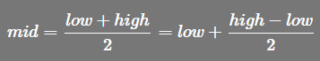
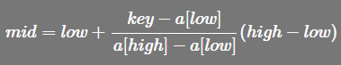
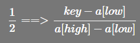

<!-- TOC -->

- [插值查找算法](#插值查找算法)
  - [原理介绍](#原理介绍)

<!-- /TOC -->

## 插值查找算法

### 原理介绍
- 插值查找类似于二分查找, 不同在于插值查找每次从自适应 mid 处开始查找

- 从二分查找中的求 mid 的索引公式修改得出插值查找的索引公式  
  其中 low 表示左索引, high 表示右索引  
  - 二分查找的 mid 索引公式  
    

  - 插值查找的 mid 索引公式  
    

- 上述公式中主要改变的是 `(high - low)` 的系数  
  - 如下图所转换 系数从 `1/2` 转换成 `(key-a[low])/(a[high]-a[low])`  
  