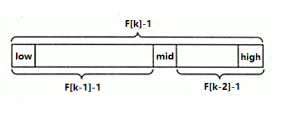

## 斐波那契(黄金分割法)查找

### 基本介绍
- 黄金分割点是指将一条线段分为两部分,  
  使其中一部分与全长之比等于另一部分与这部分之比.  
  取其前三位数字的近似值是 0.618, 也称为中外比.

- 在斐波那契数列中发现数列中的两个相邻数的比值,  
  无限接近黄金分割值 0.618.

****
### 算法原理
- 斐波那契算法原理与二分和插值查找类似, 仅仅改变了中间节点 mid 的位置

- mid 不再是中间或者插值得到, 而是位于黄金分割点附近.  

- 即 `mid = low + F[k-1] - 1`, 其中 F 代表斐波那契数列.  
  

****
### 对 F(k-1)-1 的理解
1. 由斐波那契数列 `F[k] = F[k-1] + F[k-2]` 的性质,  
   可以得到 `F[k]-1 = (F[k-1]-1) + (F[k-2]-1) + 1`  

2. 由此说明: 只要顺序表长度为 `F[k] - 1`, 就可将其分解,  
   分解成长度为`F[k-1] - 1` 和 `F[k-2] - 1` 的两段.  
   如上图所示, 从而得到中间位置 `mid = low + F[k-1] - 1`

3. 因此类似的, 每一子段也可以用相同的方式进行分割.

4. 但顺序表的长度 n 并不一定就刚好等于 `F[k] - 1`,  
   因此需要将原来的顺序表长度 n 增加到 `F[k] - 1`.  
   这里的 k 值只要能让 `F[k] - 1` 恰好大于等于 n 即可,  
   由以下代码得到, fib() 为斐波那契数列函数,   
   ```java
   while(n>fib(k)-1)
     k++;
   ```
   顺序表长度增加后,  
   新增位置从 `n+1` 到 `F[k] - 1` 都赋为 n 位置的值即可.
   
****   
### 斐波那契算法总结
斐波那契查找是折半查找的升级版, 那么也要求序列是有序的序列;

在最坏情况下, 斐波那契查找的时间复杂度还是 O(log<sub>2</sub>n), 且其期望复杂度也为 O(log<sub>2</sub>n),

但是与折半查找相比, 斐波那契查找的优点是它只涉及加法和减法运算, 而不用除法,

而除法比加减法要占用更多的时间, 因此,斐波那契查找的运行时间理论上比折半查找小,

但是还是得视具体情况而定.

****
### 代码实现

```java

```