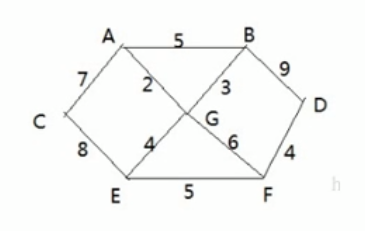
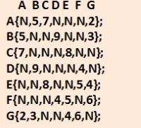
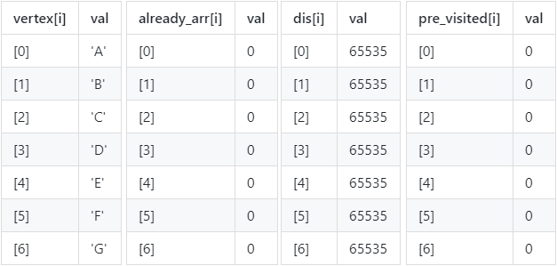
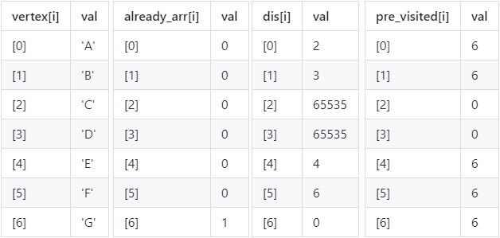

<!-- TOC -->

- [1. 迪杰斯特拉(Dijkstra)算法的原理](#1-迪杰斯特拉dijkstra算法的原理)
  - [1.1. 算法应用场景-最短路径问题](#11-算法应用场景-最短路径问题)
  - [1.2. 基本介绍](#12-基本介绍)
  - [1.3. 步骤详解](#13-步骤详解)
  - [1.4. 思路解析](#14-思路解析)
  - [1.5. 图解步骤](#15-图解步骤)

<!-- /TOC -->

## 1. 迪杰斯特拉(Dijkstra)算法的原理

### 1.1. 算法应用场景-最短路径问题
  
- 战争时期, 胜利乡有 7 个村庄`{'A','B','C','D','E','F','G'}`,  
  现在有 6 个邮差, 从 G 点出发, 需要分别把邮件送往其余 6 个村庄.  

- 各个村庄的距离用变表示(权), 比如 `A-B` 距离 5 公里

- 如何计算出 G 村庄到其它各个村庄的最短距离?  

- 如果从其他村庄出发到各个村庄的最短距离又是多少?  

### 1.2. 基本介绍
- 迪杰斯特拉(Dijkstra)算法是典型最短路径算法, 用于计算一个结点到其它结点的最短路径.
- 它的主要特点是以起始点为中心向外层层扩展(广度优先搜索思想), 直到扩展到终点为止.

### 1.3. 步骤详解
- 设置出发点为 v, 顶点集合为 `V={v1,v2,vi...}`, v 到 V 中各点的距离构成距离集合 Dis.  

- `Dis={d1,d2,di...}`, Dis 集合记录着 v 到图中各顶点的距离, v 到自身可看做 0, v 到 vi 距离为 di.
  - 从 Dis 中选择值最小的 di 并移出 Dis 集合,  
    同时已出 V 集合中对应的顶点 vi,  
    此时的 v 到 vi 即为最短路径.

  - 更新 Dis 集合, 更新规则为: 比较 v 到 V 集合中顶点的距离值,  
    与 v 通过 vi 到 V 集合中顶点的距离值, 保留值较小的一个,  
    同时更新顶点的前驱结点为 vi, 表明是通过 vi 到达的.

  - 重复执行两步骤, 直到最短路径顶点为目标顶点即可结束.

### 1.4. 思路解析
- 要建立一个已访问顶点的类, 包含三个数组对访问信息进行记录

- 第一个是记录顶点是否被访问过的数组 `already_arr[]`,  
  已访问为 1, 未访问为 0, 会进行动态更新.  
  数组下标 i 对应的是第 i 个顶点,  
  数组成员 arr[i] 对应这个顶点是否被访问过.  

- 第二个是记录出发顶点到其它所有顶点的距离的数组 `dis[]`,  
  数组下标依旧对应的是第 i 个顶点, 数组成员则对应的是距离大小,  
  例如题中以 G 为出发点, 就会记录 G 到其它顶点的距离,  
  如 `arr[i] = n` 表示 G 到第 i 个顶点的距离为 n,  
  会动态进行更新, 求得的最短距离就会存放到数组中.
  
- 第三个是记录顶点的前驱结点的数组 `pre_visited[]`,  
  数组下标 i 对应的是第 i 个顶点,  
  数组成员 arr[i] 对应前驱结点在顶点数组中的下标.  
  例如 `arr[i] = j` 表示 第 i 个顶点的前驱结点是第 j 个顶点.    

### 1.5. 图解步骤

- 如下图所示, 下图是上述例题中的图的邻接矩阵.  
  

- 以 G 为起点进行访问的话, 是用广度优先的原则进行遍历.  
  因此会逐个对其邻接顶点进行访问, 访问的顶点为 `A,B,E,F`.

- 首先对三个数组进行初始化数值
  - `already_arr` 数组所有成员初始化为 0, 表示未对顶点作为起点进行访问.   
  - `dis[]` 数组的所有成员初始化为 65535, 表示所有顶点之间都不连通.  
  - `pre_visited[]` 数组的所有成员初始化为 0, 表示所有成员都没有前驱结点.  
    

- 然后以 G 为起点进行广度优先遍历, 并动态更新以上三个数组.  
  - 已访问数组中更新 `already_arr[i]=1` 表示点 G 已被作为起点访问过了.  
  - 距离数组中更新点 G 到各个点之间的权值, 点自己到自己的距离为 0,  
    能连通则写上边的权值, 不能连通则仍旧为 65535.  
  - 然后已被遍历的顶点的前驱结点的值, 即前驱结点的数组下标皆为 6.  
     

- 以此类推, 接下来以 `A,B,E,F` 作为起点分别对其邻接顶点进行访问,  
  并从中比较 G 到剩余顶点的距离值, 与 G 通过 `A,B,E,F` 到 剩余顶点的距离值,  
  保留值较小的一个, 并将这个最小值放入距离数组中,  
  直到最短路径顶点为目标顶点即可结束, 即全部顶点都被访问过即可.  