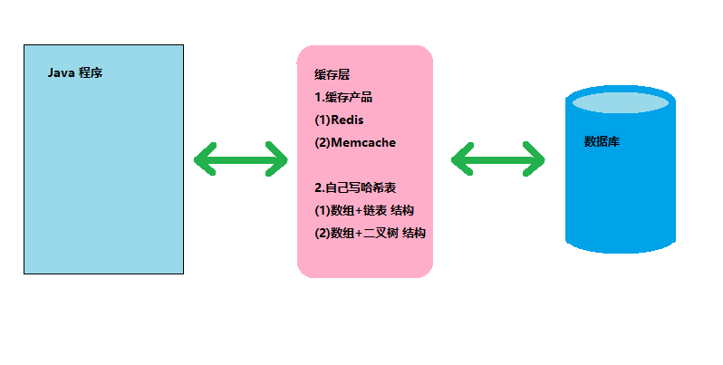
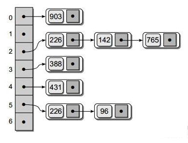

<!-- TOC -->

- [哈希表的介绍和内存布局](#哈希表的介绍和内存布局)
  - [哈希表的基本介绍](#哈希表的基本介绍)
  - [哈希表的由来](#哈希表的由来)
    - [直接连接数据库的缺点](#直接连接数据库的缺点)
    - [通过哈希表建立缓存提升速度](#通过哈希表建立缓存提升速度)
  - [哈希表的内存结构](#哈希表的内存结构)
    - [数组加链表形式的哈希表](#数组加链表形式的哈希表)

<!-- /TOC -->

## 哈希表的介绍和内存布局

### 哈希表的基本介绍
- 哈希表(Hash Table)也叫散列表  

- 是根据关键码值(Key Value)而直接进行访问的数据结构

- 即哈希表通过吧关键码值映射到表中一个位置来访问记录, 从而加快查找的速度.

- 这个映射函数叫做散列函数, 存放记录的数组叫做散列表

****
### 哈希表的由来
  
#### 直接连接数据库的缺点
- 通常来说 Java 程序操作数据最基础的方式是直接连数据库进行发送操作指令
- 在数据库接收到指令后处理相关数据并最终返回给 Java 程序
- 但这种操作存在着缺陷, 有时候需要对数据库频繁进行操作, 会导致速度变慢

#### 通过哈希表建立缓存提升速度
- 因此可以在程序和数据库之间建立一个缓存层, 将一些常用数据放入其中  
- 在缓存层操作数据可以减少对数据库的操作, 从而提升了速度
- 缓存层可以使用缓存产品或者自建哈希表来进行构建
- 自建哈希表有两种形式, 分别是数组加链表的结构, 以及数组加二叉树的结构.
- 而且若一级缓存不够还可以加二级缓存

****
### 哈希表的内存结构
#### 数组加链表形式的哈希表
  
- 在数组中每个元素存放的是一条链表
- 当查找数据的时候会根据查找的 ID 通过散列函数进行计算
- 然后找出目标可能会在哪一条链表中出现, 再去确定是否存在