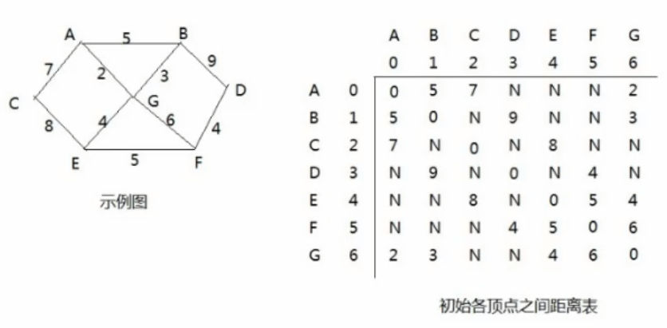
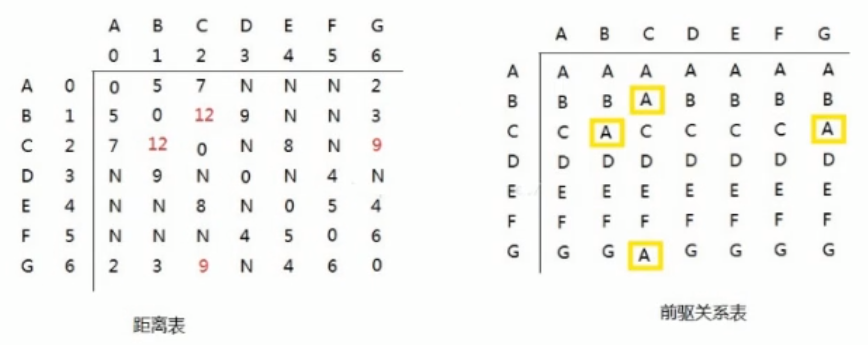

<!-- TOC -->

- [1. 弗洛伊德(Floyd)算法的原理](#1-弗洛伊德floyd算法的原理)
  - [1.1. 基本介绍](#11-基本介绍)
    - [1.1.1. 弗洛伊德算法和迪杰斯特拉算法比较](#111-弗洛伊德算法和迪杰斯特拉算法比较)
  - [1.2. 算法步骤](#12-算法步骤)
  - [1.3. 步骤图解](#13-步骤图解)
    - [1.3.1. 第一轮循环](#131-第一轮循环)
    - [1.3.2. 找出每个点作为中间结点的原理](#132-找出每个点作为中间结点的原理)

<!-- /TOC -->

## 1. 弗洛伊德(Floyd)算法的原理

### 1.1. 基本介绍
- 和迪杰斯特拉算法一样, 弗洛伊德(Floyd)算法也是一种用于寻找给定的加权图中顶点间最短路径的算法.

- 该算法名称以创始人之一, 1978 年图灵奖获得者, 斯坦福大学计算机科学系教授罗伯特弗洛伊德命名.

#### 1.1.1. 弗洛伊德算法和迪杰斯特拉算法比较
- 迪杰斯特拉算法计算图中图中某一顶点到其它顶点的最短路径.  
  迪杰斯特拉算法通过选定的被访问顶点,  
  算出从出发访问顶点到其它顶点的最短路径.

- 弗洛伊德算法计算图中各顶点到其它顶点之间的最短路径.  
  弗洛伊德算法中每一个顶点都是出发访问点,  
  所以需要将每一个顶点看作被访问顶点,  
  从而算出从每一个顶点到其他它顶点的最短路径.

### 1.2. 算法步骤
- 假设顶点 `v[i]` 到顶点 `v[k]` 的最短路径为已知的 `L[i][k]`,  
  顶点 `v[k]` 到 `v[j]` 的最短路径为已知的 `L[k][j]`,  
  顶点 `v[i]` 到 `v[j]` 的路径为 `L[i][j]`,  
  则 `v[i]` 到 `v[j]` 的最短路径为 `min{(L[i][k] + L[k][j]), L[i][j]}`,  
  `v[k]` 的取值为图中的所有顶点, 则可获得 `v[i]` 到 `v[j]` 的最短路径.  

- 至于 `v[i]` 到 `v[k]` 的最短路径 `L[i][k]` 或 `v[k]` 到 `v[j]` 的最短路径 `L[k][j]`,  
  是以上述同样的方式获得的.

### 1.3. 步骤图解
- 以下图为例进行步骤讲解, 下图是一张连通图和其邻接矩阵.  
  

- 下图是初始化的顶点间的前驱关系的矩阵.  
  在初始化的时候认为自身顶点到其它顶点的前驱结点都是自己.  
  此矩阵会后续进行动态更新来进行前驱结点的关系调整.
    

- 下面开始进行算法循环, 算法主要对点到点的距离表和前驱关系表进行动态操作.  

#### 1.3.1. 第一轮循环
在第一轮循环中, 以 A 点(下标为 0)作为中间结点, 两表更新如下.  
  
- 即把 A 点作为中间顶点的所有情况进行遍历, 以下列举情况.  
(1) `[C -> A -> B] = 12`  
(2) `[C -> A -> G] = 9`  
(3) `[B -> A -> G] = 7`  

- 然后在邻接矩阵 `graph_matrix[][]` 中的权值距离更新如下:  
  - `[C -> A -> B]` 对应的是 C 点到 B 点的距离,   
      - 原来两点间的距离为不连通或极大值, 而新值为 12 比原值要小, 因此进行替换.  
      
      - 因为是无向图, 所以中心对称位置的同样也要进行更新, 如下所示:  
      `graph_matrix[2][1] = N -> graph_matrix[2][1] = 12`  
      `graph_matrix[1][2] = N -> graph_matrix[1][2] = 12`  
      
      - 同时 C 到 B 之间的结点替换为 A. 同理 B 到 C 的也是.  
        即 C 到 B 之前要先到 A 点, B 到 C 之前要先到 A 点.

  - `[C -> A -> G]` 对应的是 C 点到 G 点的距离,   
      - 原来两点间的距离为不连通或极大值, 而新值为 9 比原值要小, 因此进行替换.  
      
      - 因为是无向图, 所以中心对称位置的同样也要进行更新, 如下所示:  
      `graph_matrix[2][6] = N -> graph_matrix[2][6] = 9`  
      `graph_matrix[6][2] = N -> graph_matrix[6][2] = 9`  
      
      - 同时 C 到 G 之间的结点替换为 A. 同理 G 到 C 的也是.  
        即 C 到 G 之前要先到 A 点, G 到 C 之前要先到 A 点.

  - `[B -> A -> G]` 对应的是 B 点到 G 点的距离,  
      - 原本点 B 到点 G 之间的距离为 3, 而 `[B -> A -> G]` 距离为 7,  
      
      - 以保留最短路径为原则, 原值比新值更小, 因此这里不需要替换原来的值.

#### 1.3.2. 找出每个点作为中间结点的原理  
- 有以下三个数组作为三层遍历的前提需要
  - 中间顶点 `mid_arr = {'A','B','C','D','E','F','G'}`
  - 出发顶点 `sta_arr = {'A','B','C','D','E','F','G'}`
  - 结束顶点 `end_arr = {'A','B','C','D','E','F','G'}`

- 首先第一层循环限定中间顶点, 给定 k 作为索引, k 从 0 开始,  
  k 最大值为数组长度减一.

- 然后第二层循环限定出发顶点, 给定 i 作为索引, i 从 0 开始,  
  i 最大值为数组长度减一.

- 接着第三层循环限定结束顶点, 给定 j 作为索引, j 从 0 开始,  
  j 最大值为数组长度减一.  

- 最后再在第三层循环的循环体内开始如下操作:  
  - 假设现在的中间顶点是 `mid_arr[k]`  
  - 先算出 `sta_arr[i]` 到 `end_arr[j]` 的距离, 定为 `Lse`.
  - 再算出 `sta_arr[i]` 到 `mid_arr[j]` 的距离, 定为 `Lsm`. 
  - 再算出 `mid_arr[j]` 到 `end_arr[j]` 的距离, 定位 `Lme`.
  - 其中 `Lsm + Lme` 就是起点经由中间点到终点的距离,  
    而 `Lse` 就是起点直接到终点的距离.
  - 接着对比 `Lse` 和 `Lsm + Lme` 的大小, 保留它们最小的那个.
  - 然后更新距离表中的值, 即 `graph_matrix[i][j] = min{Lse,(Lsm + Lme)}`
  - 最后再更新中间结点表即可.

- 当三层循环结束, 就能得到每个顶点到其它所有顶点的最短距离.
