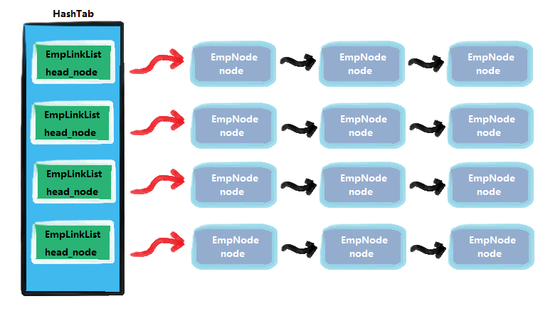

<!-- TOC -->

- [哈希表的应用实例](#哈希表的应用实例)
  - [谷歌的上机题](#谷歌的上机题)
- [思路分析](#思路分析)
  - [链表类](#链表类)
  - [节点类](#节点类)
  - [哈希表类](#哈希表类)
- [代码实现](#代码实现)

<!-- /TOC -->

### 哈希表的应用实例
#### 谷歌的上机题
- 题目  
有一个公司, 当有新的员工来报到时, 要求将该员工的信息加入,  
员工信息包括 id, 名字, 性别, 年龄, 住址等,  
当输入该员工的 id 时要查找到该员工的所有信息.

- 要求  
  - 不使用数据库, 速度越快越好 (即要求使用哈希表)
  - 添加时, 保证按照 id 从低到高插入

****
### 思路分析


- 如上图所示, 用哈希表来管理雇员信息需要构建三个类
  
#### 链表类
构建链表类, 主要用来实现存放每个链表对应的头结点和增删查改节点的方法

#### 节点类
构建节点类, 主要用于实现每个节点内存放雇员的 id, 姓名等信息


#### 哈希表类
构建哈希表类, 主要用于实现链表数组用于存放每个链表的头结点,   
以及实现调用增删查改节点和构建散列函数使 id 对应到相应链表的方法

### 代码实现
```java

```