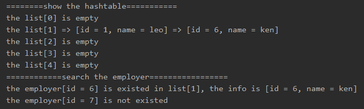

<!-- TOC -->

- [哈希表的应用实例](#%E5%93%88%E5%B8%8C%E8%A1%A8%E7%9A%84%E5%BA%94%E7%94%A8%E5%AE%9E%E4%BE%8B)
    - [谷歌的上机题](#%E8%B0%B7%E6%AD%8C%E7%9A%84%E4%B8%8A%E6%9C%BA%E9%A2%98)
- [思路分析](#%E6%80%9D%E8%B7%AF%E5%88%86%E6%9E%90)
    - [链表类](#%E9%93%BE%E8%A1%A8%E7%B1%BB)
    - [节点类](#%E8%8A%82%E7%82%B9%E7%B1%BB)
    - [哈希表类](#%E5%93%88%E5%B8%8C%E8%A1%A8%E7%B1%BB)
- [代码实现](#%E4%BB%A3%E7%A0%81%E5%AE%9E%E7%8E%B0)
    - [节点类](#%E8%8A%82%E7%82%B9%E7%B1%BB)
    - [链表类](#%E9%93%BE%E8%A1%A8%E7%B1%BB)
    - [哈希表类](#%E5%93%88%E5%B8%8C%E8%A1%A8%E7%B1%BB)
    - [测试类](#%E6%B5%8B%E8%AF%95%E7%B1%BB)
- [测试结果](#%E6%B5%8B%E8%AF%95%E7%BB%93%E6%9E%9C)

<!-- /TOC -->

### 哈希表的应用实例
#### 谷歌的上机题
- 题目  
有一个公司, 当有新的员工来报到时, 要求将该员工的信息加入,  
员工信息包括 id, 名字, 性别, 年龄, 住址等,  
当输入该员工的 id 时要查找到该员工的所有信息.

- 要求  
  - 不使用数据库, 速度越快越好 (即要求使用哈希表)
  - 添加时, 保证按照 id 从低到高插入

****
### 思路分析


- 如上图所示, 用哈希表来管理雇员信息需要构建三个类
  
#### 链表类
构建链表类, 主要用来实现存放每个链表对应的头结点和增删查改节点的方法

#### 节点类
构建节点类, 主要用于实现每个节点内存放雇员的 id, 姓名等信息


#### 哈希表类
构建哈希表类, 主要用于实现链表数组用于存放每个链表的头结点,   
以及实现调用增删查改节点和构建散列函数使 id 对应到相应链表的方法

****
### 代码实现
- 实现细节看注释

#### 节点类
```java
package com.leo9.dc21.hash_table;

//定义员工节点类, 用来存放员工信息
//同时链表是单链表, 所以只需要定义指向下一节点
public class EmpNode {
    public int id;
    public String name;
    public EmpNode next_emp;

    public EmpNode(int id, String name) {
        this.id = id;
        this.name = name;
    }
}

```

#### 链表类
```java
package com.leo9.dc21.hash_table;

//定义员工链表类, 存放每个链表的头节点, 和实现链表增删查改的方法
public class EmpLinkList {
    //头节点, 指向当前链表的第一个员工, 因此头节点是有效节点
    private EmpNode head_node;

    //定义添加新员工节点的方法
    //假定添加员工时, id是自增长的, 即id总是从小到大
    //因此直接将新节点添加到链表尾部即可
    public void addEmployer(EmpNode new_node){
        //先判断头节点是否为空
        if(head_node == null){
            head_node = new_node;
            return;
        }

        //如果不是当前链表的第一个员工, 使用辅助指针帮助定位
        EmpNode cur_node = head_node;
        while(true){
            if(cur_node.next_emp != null){
                cur_node = cur_node.next_emp;
            }else {
                cur_node.next_emp = new_node;
                break;
            }
        }
    }

    //遍历链表的雇员信息
    public void viewList(int no){
        //判断头节点是否为空, 如果为空则链表为空
        if(head_node == null){
            System.out.printf("the list[%d] is empty\n", no);
            return;
        }
        System.out.printf("the list[%d] ", no);
        EmpNode cur_node = head_node;
        while(true){
            //输出节点信息
            System.out.printf("=> [id = %d, name = %s]\t", cur_node.id, cur_node.name);
            //判断当前节点下一位是否为空, 为空则跳出循环
            if(cur_node.next_emp == null){
                break;
            }
            //后移一位
            cur_node = cur_node.next_emp;
        }
        System.out.println();
    }

    //根据id查找员工
    //如果找到就返回员工相应信息, 如果没找到就返回null
    public EmpNode searchEmpById(int id){
        //先判断当前链表是否为空
        if(head_node == null){
            //System.out.println("this list is empty");
            return null;
        }

        //遍历链表寻找是否存在员工
        EmpNode cur_node = head_node;
        while(true){
            //找到则跳出循环, 然后返回该员工节点.
            if(cur_node.id == id){
                break;
            }
            //全表遍历完仍找不到则返回空
            if(cur_node.next_emp == null){
                //System.out.println("this employer is not existed");
                return null;
            }
            cur_node = cur_node.next_emp;
        }
        return cur_node;
    }
}

```

#### 哈希表类
```java
package com.leo9.dc21.hash_table;

//定义HashTable 管理多条链表
public class EmpHashTable {
    private EmpLinkList[] empLinkListsArray;
    //定义一个尺寸表示该哈希表中存放有多少条链表
    private int size;

    //构造器, 指定哈希表有多少条链表, 并进行初始化
    public EmpHashTable(int size){
        this.size = size;
        //根据尺寸构建哈希表
        empLinkListsArray = new EmpLinkList[size];
        //初始化哈希表内的每一条链表
        for (int i = 0; i < size; i++) {
            empLinkListsArray[i] = new EmpLinkList();
        }
    }

    //编写散列函数, 使用取模法进行编写
    public int hashFun(int id){
        return id % size;
    }

    //添加员工
    public void add(EmpNode emp_node){
        //根据员工的id, 得到该员工应当添加到哪条链表
        int empLinkListNO = hashFun(emp_node.id);
        //将员工节点添加到对应的链表中
        empLinkListsArray[empLinkListNO].addEmployer(emp_node);
    }

    //遍历哈希表的所有链表
    public void viewList(){
        for(int i = 0; i < size; i++){
            empLinkListsArray[i].viewList(i);
        }
    }

    //查找员工
    public void searchEmpById(int id){
        EmpNode node = empLinkListsArray[hashFun(id)].searchEmpById(id);
        if(node != null){
            System.out.printf("the employer[id = %d] is existed in list[%d], the info is [id = %d, name = %s]\n", id, hashFun(id), node.id, node.name);
        }
        else {
            System.out.printf("the employer[id = %d] is not existed\n", id);
        }
    }
}

```

#### 测试类
```java
package com.leo9.dc21.hash_table;

public class TestDemoHT {
    public static void main(String[] args) {
        EmpHashTable emp_table = new EmpHashTable(5);
        emp_table.add(new EmpNode(1,"leo"));
        emp_table.add(new EmpNode(6,"ken"));
        emp_table.viewList();
        emp_table.searchEmpById(6);
        emp_table.searchEmpById(7);
    }
}

```

****
### 测试结果
